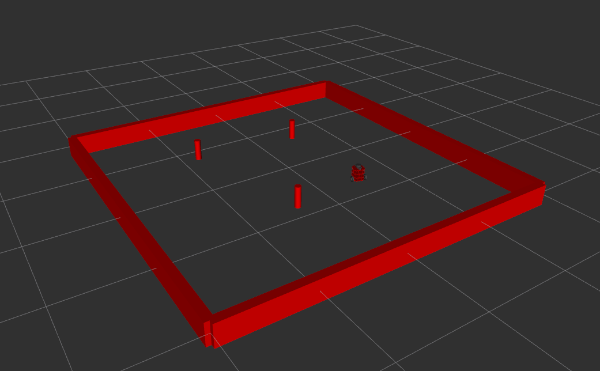

# Nusim

Author: Shail Dalal  
The node is used to simulate a turtlebot in RVIZ.

## Parameters Description

* `rate (double)`: rate of the timer (in Hz)
* `x0 (double)`: start location of the red bot (m)
* `y0 (double)`: start location of the red bot (m)
* `theta0 (double)`: start orientation of the red bot (rad)
* `obstacles/x (double[])`: Obstacles x position wrt nusim/world (m)
* `obstacles/y (double[])`: Obstacles y position wrt nusim/world (m)
* `obstacles/r (double)`: radius of the obstacles (cylinder) (m)
* `arena_x_length`: length of arena (m)
* `arena_y_length`: width of arena (m)

## Quickstart
1. Use `ros2 launch nusim nusim.launch.xml` to start the simulation in RVIZ
2. Use `ros2 service call /nusim/reset std_srvs/srv/Empty` to reset the simulation to the initial position
3. Use `ros2 service call /nusim/teleport nusim/srv/Teleport "{x: 1.2, y: 1.3, theta: 6.5}"` to teleport the bot in RVIZ
4. Here is a picture of the turtlebot in the arena

