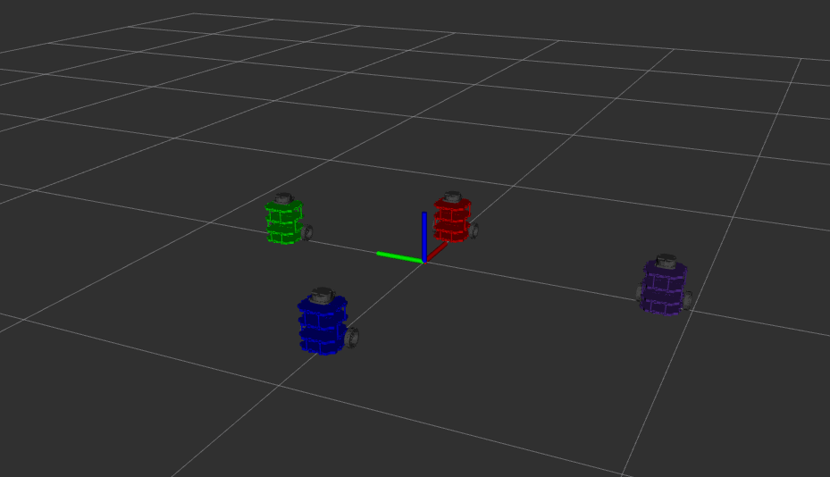

# Nuturtle  Description
URDF files for Nuturtle <Champ>
* `<ros2 launch nuturtle_description load_one.launch.py>` to see the robot in rviz.
* `<ros2 launch nuturtle_description load_all.launch.xml>` to see four copies of the robot in rviz.

* The rqt_graph when all four robots are visualized (Nodes Only, Hide Debug) is:

# Launch File Details
* `<ros2 launch nuturtle_description load_one.launch.py --show-args>`  
  `Arguments (pass arguments as 'name:=value'):

    'use_jsp':
        true (default): use joint state publishes,                false: no joint states published
        (default: 'true')

    'use_rviz':
        true (default): use rviz,                false: no rviz used
        (default: 'true')

    'color':
        purple(default):change turtlebot color to purple,                red:change turtlebot color to red,                green:change turtlebot color to green,                blue:change turtlebot color to blue. Valid choices are: ['purple', 'red', 'green', 'blue']
        (default: 'purple') `
`
* `<ros2 launch nuturtle_description load_all.launch.xml --show-args>`  
  `Arguments (pass arguments as   'name:=value'):

    'use_jsp':
        true (default): use joint state publishes,                false: no joint states published
        (default: 'true')

    'use_rviz':
        true (default): use rviz,                false: no rviz used
        (default: 'true')

    'color':
        purple(default):change turtlebot color to purple,                red:change turtlebot color to red,                green:change turtlebot color to green,                blue:change turtlebot color to blue. Valid choices are: ['purple', 'red', 'green', 'blue']
        (default: 'purple')
`